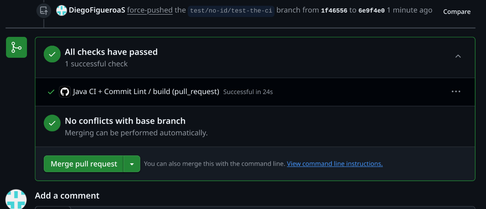

# Proyecto: Calculadora por Consola en Java

## Equipo: Conflicto

**Integrantes:**
1. Diego Hernan Figueroa Sevillano
2. André Helian Aldunate Guzmán
3. Dylan Fabricio Cossio Rocha
4. Bladimir Luna Corrales

---

## ¡Revisar la Wiki antes de todo!

Toda la documentación detallada del proyecto (arquitectura, CI, flujo de ramas, templates, DoD/DoR, etc.) se encuentra disponible en la WIKI.

---

## Resumen del Proyecto

Este proyecto consiste en una **calculadora simple en Java por consola**, pero implementada bajo un enfoque **profesional**, utilizando principios **SOLID**, **Gitflow**, **CI/CD con GitHub Actions**, y una arquitectura extensible.

---

## Integración Continua (CI)

Se configuró un flujo de CI con **GitHub Actions** que realiza:

- Validación del nombre del **branch**  
- Validación de los **mensajes de commit** (`commitlint`)  
- Validación de **estructura del proyecto (build Maven)**

### Validación del nombre del branch
Se asegura que las ramas cumplan el formato `feature/xx/descripcion`, `bugfix/xx/descripcion`, etc.  
Si no, el CI falla.

### Validación de commits
Todos los mensajes deben seguir una convención semántica (`feat:`, `fix:`, etc.) y tener título en imperativo sin punto final.

### Build Java
Se compila el proyecto con Maven para asegurar que todo compile correctamente antes de mergear.

### Ejemplo de CI pasando:

### Ejemplo de CI fallando:

---

## Reglas del Branch Protection

Se configuraron reglas en GitHub para asegurar calidad y orden en los merges:

- Al menos **1 revisor obligatorio**:
  

- Todos los **comentarios deben estar resueltos** antes de mergear:
  

- No se puede hacer merge si el CI falla.

## Flujo de trabajo

Se sigue un flujo **Gitflow profesional**:

- Ramas: `main`, `develop`, `feature/xx/desc`, `bugfix/xx/desc`, `hotfix/xx/desc`
- Validaciones automáticas mediante CI
- Pull Requests con template obligatorio
- Uso del tablero Trello para visualizar el ciclo de vida de cada historia (ver Wiki)

Template de Pull Request:
  

---

## Errores encontrados

Durante el desarrollo se produjo un **conflicto** al mergear una rama.  
Este conflicto fue **detectado a tiempo, solucionado y resuelto correctamente antes del merge final**.

Imagen del conflicto detectado:
  

---

## Estado actual del proyecto

- [x] Arquitectura diseñada y documentada
- [x] CI implementado y funcional
- [x] Plantilla de Pull Request activa
- [x] Reglas de protección en ramas activas
- [x] User Stories definidas y organizadas
- [x] Código base creado con enfoque modular y escalable

---
